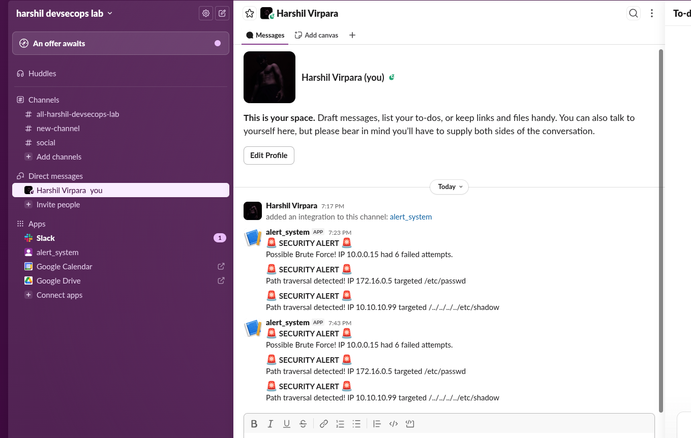

# Project 3: Real-Time DevSecOps Alerting Engine

##  What does it do?
This engine upgrades the Anomaly Hunter by giving it a "voice." When brute-force attacks or path traversal attempts are detected in server logs, this script instantly pushes a formatted alert to a DevSecOps Slack channel using **Webhooks**.

To prevent "alert fatigue" (spamming the team during a massive attack), it implements a **Stateful Rate Limiter**. It tracks attacker IP addresses in a local `state.json` file and ensures duplicate alerts for the same IP are suppressed for a 5-minute cooldown window.

##  Proof of Work: Live Slack Alerts




## Requirements & Installation
* **Python 3.x**
* **External Libraries:** `requests`
* Install dependencies via terminal:
  ```bash
  pip install requests

```

## 🚀 How to Run

1. Set up an Incoming Webhook in your Slack or Discord workspace.
2. Open `alerting_engine.py` and paste your Webhook URL into the `WEBHOOK_URL` variable. *(Note: Never commit your real webhook URL to public repositories!)*
3. Run the engine against your parsed logs:

```bash
python3 alerting_engine.py -f result.json

```

## 🧠 Core Features Built

* **Real-Time Webhook Integration:** Uses HTTP POST requests to trigger external chat notifications in milliseconds.
* **Stateful Rate Limiting:** Uses a JSON-based clipboard (`state.json`) to track timestamps and throttle duplicate alerts.
* **Graceful Error Handling:** Fails safely if the log file is missing or if the Webhook URL is unreachable.


